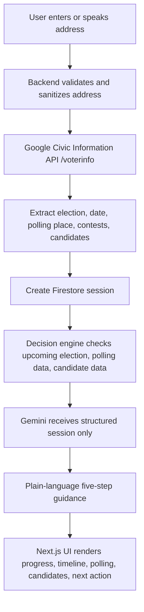

# MVP Workflow And Criteria Map

This file is meant for judges and reviewers. It explains the MVP in a compact, criteria-focused way.

## Workflow Diagram

## Working Of Each Step

1. Input: The user types an address or uses the centered microphone. This improves access for users who struggle with typing.
2. Validation: The server rejects empty or oversized addresses and removes prompt-injection markers before any API call.
3. Civic data: The backend calls Google Civic Information API using a server-only key.
4. Extraction: The app copies only known Civic fields into a normalized object. Pending data becomes `Official data pending.`
5. Session: Firestore stores the sanitized address, normalized election data, current step, and timestamps.
6. Decision engine: Three flags guide the response: upcoming election, polling location present, candidate data present.
7. Gemini: Gemini receives only the structured session object and is instructed not to infer facts.
8. Render: The UI shows five sequential steps with progress indicators and clear next actions.

## Evaluation Criteria Checklist

- Code quality: Next.js App Router, typed data models, separated server modules, simple API shape.
- Security: server-only keys, sanitized address input, rate limiting, controlled Gemini prompt, no raw input in AI prompt.
- Efficiency: one Civic call per session, compact extraction, fallback guidance if Gemini fails.
- Testing readiness: typecheck and npm audit pass; README lists targeted unit, integration, AI, and edge-case tests.
- Accessibility: voice input, high contrast black/white/gold palette, keyboard-friendly buttons, plain-language output.
- Google services: Civic API, Gemini, Firestore, Firebase Auth, Speech-to-Text, Cloud Run, Secret Manager.

## Out-Of-The-Box MVP Feature

The assistant includes voice address entry as a first-class interaction, not a hidden extra. This matters because the target voter may have low literacy, poor typing confidence, or be using a mobile device under time pressure.

The next high-impact feature would be a printable or shareable “voting checklist” generated only from verified session data.
